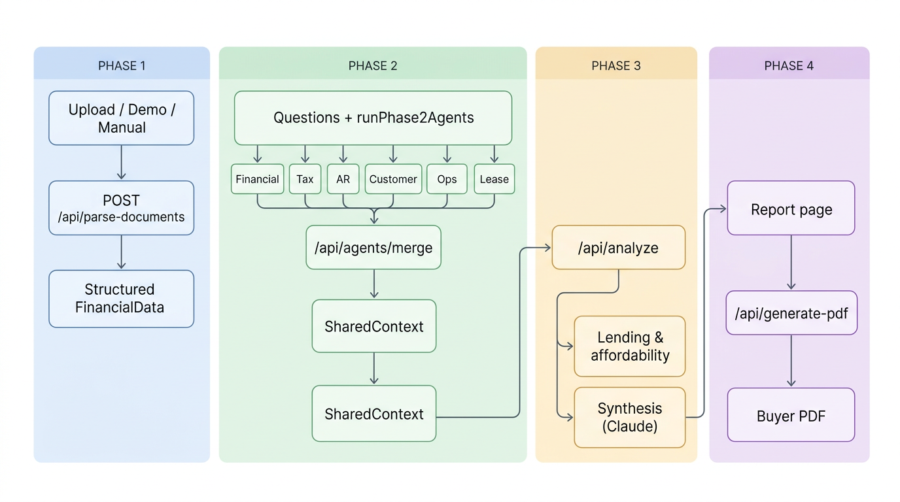
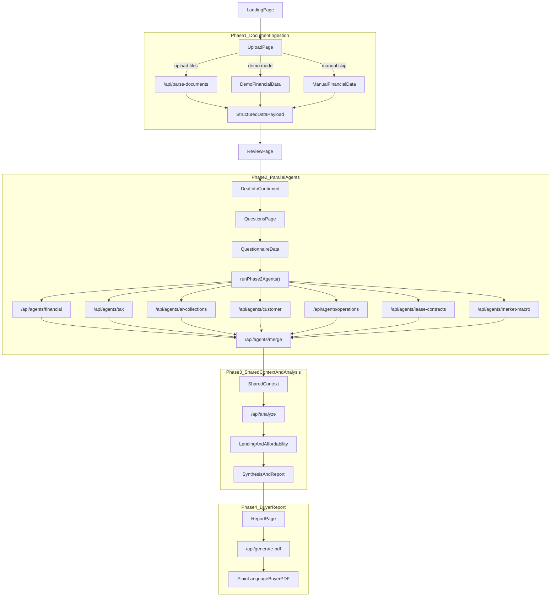

# Architecture Flow

This reflects the current application flow as implemented in the codebase today.

## Visual overview

*Generated flowchart (PNG). The Mermaid diagram in the next section is the same flow in an editable, text-based form.*

---

## Editable diagram (Mermaid)

## Notes

- `Phase 1` produces the structured financial payload from uploads, demo data, or manual entry.
- `Phase 2` runs seven specialized agents in parallel, then merges their outputs into a single shared context.
- `Phase 3` performs lending and affordability analysis, then synthesizes the final report payload.
- `Phase 4` renders the on-screen buyer report and generates a downloadable PDF.
