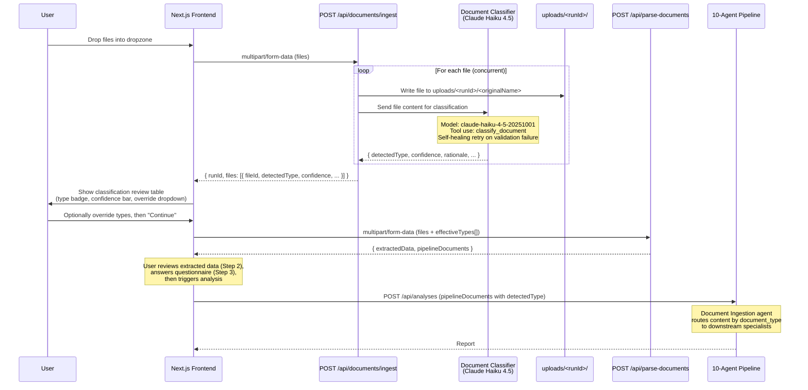

# BizBuy — Codebase Audit

**Branch:** `backend-and-skills-merge`
**Date:** 2026-04-12
**Status:** Phase 1 — read-only investigation; no code modified.

---

## 1. Repo Structure

| Path | Purpose |
|---|---|
| `/app/` | Next.js 14 App Router — frontend pages, layouts, API route (`/api/generate-pdf`) |
| `/backend/` | **Python/FastAPI** backend — the 10-agent pipeline, orchestration, scoring, report assembly. Runs as a separate process on port 8000. |
| `/backend/app/agents/` | Agent registry, prompt strings, Pydantic schemas, Claude client, deterministic pre-computation, and runner functions for all 10 agents. |
| `/backend/app/api/` | FastAPI route handlers: `/health`, `/parse-documents`, `/analyze`, `/analyses`, `/pipeline`. |
| `/backend/app/core/` | Settings / config (all env var parsing). |
| `/backend/app/models/` | Pydantic models for HTTP request/response contracts (legacy `ReportOutput`, v2 `ReportOutputV2`). |
| `/backend/app/services/` | Business logic: ingestion, document parsing, intake normalization, scoring engine, report assembler, clarification service, analysis jobs. |
| `/backend/tests/` | pytest test suite for backend services. |
| `/components/` | Shared React components — `layout/`, `report/`, `ui/` (shadcn), `upload/FileDropZone`. |
| `/context/` | `AnalysisContext.tsx` — React context + reducer for the 4-step wizard state. |
| `/lib/` | Frontend utilities: `api-client.ts`, `calculations.ts`, `clarification-service.ts`, `constants.ts`, `demo-data.ts`, `format.ts`, `prompts.ts`, `report-normalization.ts`, `report-pdf.tsx`, `risk-scoring.ts`, `types.ts`, `utils.ts`. |
| `/src/` | Contains only `main.py` — **empty file, appears orphaned**. |
| `/sample company1/`, `/sample company3 - LoneStar Plumbing/` | Sample document sets for manual testing. Not gitignored. |

### Potentially orphaned / duplicated

- **`/src/main.py`** — empty file; the actual backend entry point is `/backend/app/main.py`. Safe to delete.
- **`/lib/prompts.ts`** — exists but the real prompts live in `backend/app/agents/prompts.py` (Python). The TS file may be a legacy artifact from an earlier architecture where Claude was called from Next.js.
- **`/lib/risk-scoring.ts`** and **`/lib/calculations.ts`** — frontend-side scoring utilities that duplicate some logic already in `backend/app/services/scoring_engine.py` and `backend/app/agents/deterministic.py`. Used by the legacy `/analyze` path.
- **Multiple planning docs at root** (`ARCHITECTURE.md`, `BizzBuyBarebonesPRD.md`, `BizzbuyPlan.txt`, `MULTI_AGENT_*.md`, `RUNTIME_OVERVIEW.md`, `backend-plan.md`, `backend-math.txt`, `architecture flow.md`) — these are design artifacts, not runtime code, but they bloat the Docker build context.

---

## 2. The 10-Agent Pipeline

All agents are registered in `backend/app/agents/registry.py` via the `AGENT_REGISTRY` dict. Runner functions live in `backend/app/agents/runners.py`. Prompts are in `backend/app/agents/prompts.py` (Python string constants, not `.md` files). Schemas are in `backend/app/agents/schemas.py`.

### Agent Inventory

| # | Agent | Registry Key | Model | Cost-Routing Intent Match? | Phase | `depends_on` | Prompt Key | Output Schema |
|---|---|---|---|---|---|---|---|---|
| 1 | Document Ingestion | `document-ingestion` | `claude-haiku-4-5-20251001` | ✅ Haiku — cheap, high-volume | `INGESTION` (Phase 1) | `[]` | `DOCUMENT_INGESTION_PROMPT` | `IngestionOutput` |
| 2 | Financial Analysis | `financial-analysis` | `claude-sonnet-4-20250514` | ✅ Sonnet — core analysis | `PARALLEL_ANALYSIS` (Phase 2) | `[document-ingestion]` | `FINANCIAL_ANALYSIS_PROMPT` | `FinancialAnalysisOutput` |
| 3 | Tax Compliance | `tax-compliance` | `claude-sonnet-4-20250514` | ✅ Sonnet | `PARALLEL_ANALYSIS` (Phase 2) | `[document-ingestion]` | `TAX_COMPLIANCE_PROMPT` | `TaxComplianceOutput` |
| 4 | AR/Collections | `ar-collections` | `claude-haiku-4-5-20251001` | ✅ Haiku — simpler task | `PARALLEL_ANALYSIS` (Phase 2) | `[document-ingestion]` | `AR_COLLECTIONS_PROMPT` | `ARCollectionsOutput` |
| 5 | Customer Concentration | `customer-concentration` | `claude-haiku-4-5-20251001` | ✅ Haiku — simpler task | `PARALLEL_ANALYSIS` (Phase 2) | `[document-ingestion]` | `CUSTOMER_CONCENTRATION_PROMPT` | `CustomerConcentrationOutput` |
| 6 | Ops/Transferability | `operations-transferability` | `claude-sonnet-4-20250514` | ✅ Sonnet — judgment-heavy | `PARALLEL_ANALYSIS` (Phase 2) | `[document-ingestion]` | `OPERATIONS_TRANSFERABILITY_PROMPT` | `OpsTransferabilityOutput` |
| 7 | Lease/Contract | `lease-contract` | `claude-sonnet-4-20250514` | ✅ Sonnet — legal analysis | `PARALLEL_ANALYSIS` (Phase 2) | `[document-ingestion]` | `LEASE_CONTRACT_PROMPT` | `LeaseContractOutput` |
| 8 | Market/Macro | `market-macro` | `claude-sonnet-4-20250514` | ✅ Sonnet — requires reasoning | `PARALLEL_ANALYSIS` (Phase 2) | `[document-ingestion]` | `MARKET_MACRO_PROMPT` | `MarketMacroOutput` |
| 9 | Lending/Affordability | `lending-affordability` | `claude-sonnet-4-20250514` | ✅ Sonnet | `LENDING` (Phase 3) | `[financial-analysis]` | `LENDING_AFFORDABILITY_PROMPT` | `LendingAffordabilityOutput` |
| 10 | Synthesis Report | `synthesis-report` | `claude-opus-4-20250514` | ✅ Opus — highest quality for final output | `SYNTHESIS` (Phase 4) | all 9 upstream agents | `SYNTHESIS_REPORT_PROMPT` | `SynthesisReportOutput` |

### Cost Routing Summary

- **Haiku ($0.80/$4.00 per 1M tokens):** Ingestion, AR, Customer Concentration — high-volume / lower-complexity tasks.
- **Sonnet ($3.00/$15.00):** Financial, Tax, Ops, Lease, Market, Lending — core analysis requiring judgment.
- **Opus ($15.00/$75.00):** Synthesis only — the single most expensive call, justified as the final buyer-facing narrative.

All models match their cost-routing intent. No mismatches found.

### Phase Execution Order

```
Phase 1 (Sequential):   Document Ingestion
                              │
Phase 2 (Parallel):     ┌─────┼─────┬─────┬──────┬──────┬──────┐
                        │     │     │     │      │      │      │
                   Financial Tax  AR  Customer  Ops  Lease  Market
                        │
Phase 3 (Dependent):    Lending/Affordability (depends on Financial)
                              │
Phase 4 (Synthesis):    Synthesis Report (depends on all above)
```

---

## 3. Orchestration Layer

**File:** `backend/app/agents/orchestrator.py`

### Parallelism

The orchestrator uses **`asyncio.gather`** (not `Promise.allSettled`) for Phase 2 parallelism (line 291–303). Each agent call is wrapped in `_execute_stage()` which handles timeouts (`asyncio.wait_for`) and retries internally, returning an `AgentResult` with `status="error"` on failure rather than raising. This means `asyncio.gather` effectively behaves like `Promise.allSettled` — it never rejects, it always returns a result per agent.

> **Flag:** The user description said "Promise.allSettled" — this is a Python codebase, so the equivalent is `asyncio.gather` with error-absorbing wrappers. The behavior matches the intent.

### Synthesis Assembly

The Synthesis agent (`run_synthesis_report`) receives:
1. The `DeterministicScorecard` (computed by `scoring_engine.py`)
2. The `specialist_results_map` (all 8 specialist agent results)

The `assemble_summary_report()` function (in `report_assembler.py`) takes all outputs and produces a `ReportOutputV2` which is the final API response.

### Error / Partial Failure Propagation

- Each agent returns `AgentResult(status="success"|"error"|"skipped")`.
- If ingestion fails, all downstream agents are set to a canned abort error.
- If `financial_analysis` fails, `lending_affordability` is set to `status="skipped"` with `error_type="dependency"`.
- `PipelineMetadata.partial_failures` accumulates the names of all failed stages.
- If `pipeline_allow_partial_failures` is `False` and any specialist failed, synthesis is skipped.
- If `pipeline_enable_synthesis` is `False`, synthesis is skipped.
- Retry logic: configurable via `BIZBUY_PIPELINE_RETRY_ATTEMPTS` (default 1, meaning 1 retry after initial failure).
- Stage timeout: `BIZBUY_PIPELINE_STAGE_TIMEOUT_SECONDS` (default 90s).

---

## 4. API Surface

### Next.js Routes (Frontend — `/app/api/`)

| Route | Method | Purpose | Request | Response |
|---|---|---|---|---|
| `POST /api/generate-pdf` | POST | Renders a report to PDF using `@react-pdf/renderer` | `{ report: ReportOutput }` JSON body | Binary PDF download |

> No health check endpoint exists on the Next.js side. The only Next.js API route is PDF generation.

### FastAPI Routes (Backend — `/backend/app/api/`)

All mounted under `/api` prefix via `api_router`.

| Route | Method | Purpose | Request | Response |
|---|---|---|---|---|
| `GET /api/health` | GET | Health check | — | `{ ok, service, environment, reportMode, frontendOrigins }` |
| `POST /api/parse-documents` | POST | Upload + parse documents | `multipart/form-data` with `files` + `file_types` JSON | `ParseDocumentsResponse` |
| `POST /api/analyze` | POST | Legacy deterministic analysis (no Claude) | `AnalyzeRequest` JSON | `AnalyzeResponse` with `ReportOutput` |
| `POST /api/analyses` | POST | Start an async analysis job | `AnalysisJobRequest` JSON | `AnalysisJobResponse` (202 Accepted) |
| `GET /api/analyses/{id}` | GET | Poll analysis job status | — | `AnalysisJobResponse` |
| `POST /api/pipeline` | POST | Run the full 10-agent pipeline synchronously | `PipelineInput` JSON | `ReportOutputV2` |

> **Health check:** `GET /api/health` on the backend (port 8000). There is no health check on the Next.js frontend.

---

## 5. Frontend State

### What exists today

The 4-step wizard UI is **fully built** in the frontend:

| Step | Route | Status |
|---|---|---|
| 1. Upload | `/analyze/upload` | **Implemented** — `FileDropZone` with drag-and-drop, manual document-type dropdown per file, demo mode. |
| 2. Review | `/analyze/review` | **Implemented** — tabbed form (Income, Balance Sheet, Loan Terms, Deal Info) with confidence badges and SDE estimate. |
| 3. Questionnaire | `/analyze/questions` | **Implemented** — dynamic clarification questions (boolean, percent, select), evidence handling disclaimer. |
| 4. Report | `/analyze/report` | **Implemented** — full report rendering with sidebar nav, section components (Executive Summary, Financial Snapshot, Debt Service, Risk Assessment, Transferability, Seller Questions, Diligence Checklist, Upside, Recommendation), Deep Review toggle, loading/polling states. |

### Additional pages

- `/` — Landing page
- `/pricing` — Pricing page
- `/team` — Team page

### What is missing for the user's 4-step flow

The upload page currently **requires manual document-type selection** via a dropdown. The user's Phase 3 plan (auto-classification with Haiku) is not yet implemented — this is expected and is Phase 3 scope.

The state management (`AnalysisContext.tsx`) with session storage persistence, analysis job polling, and report normalization is fully wired.

---

## 6. Environment Variables

Complete list derived from all `process.env` and `os.getenv` references:

### Frontend (Next.js)

```env
# URL of the Python backend API (default: http://localhost:8000/api)
NEXT_PUBLIC_BACKEND_URL=http://localhost:8000/api
```

### Backend (Python/FastAPI)

```env
# Required — Anthropic API key for Claude calls
ANTHROPIC_API_KEY=

# Environment label (default: development)
BIZBUY_ENV=development

# Report mode — "deterministic" or "pipeline" (default: deterministic)
REPORT_MODE=deterministic

# Allowed CORS origins, comma-separated (default: http://localhost:3000,http://127.0.0.1:3000)
FRONTEND_ORIGIN=http://localhost:3000,http://127.0.0.1:3000

# Feature flags (all default to true)
BIZBUY_PIPELINE_ENABLED=true
BIZBUY_ANALYSIS_JOBS_ENABLED=true
BIZBUY_PIPELINE_ALLOW_PARTIAL_FAILURES=true
BIZBUY_PIPELINE_ENABLE_SYNTHESIS=true

# Pipeline tuning
BIZBUY_PIPELINE_RETRY_ATTEMPTS=1
BIZBUY_PIPELINE_STAGE_TIMEOUT_SECONDS=90

# Artifact storage directory (default: backend/.artifacts)
BIZBUY_ARTIFACT_DIR=backend/.artifacts
```

### Existing `.env.local.example`

The current file only contains:
```
NEXT_PUBLIC_BACKEND_URL=http://localhost:8000/api
ANTHROPIC_API_KEY=your_anthropic_api_key_here
```

> **Gap:** The example file mixes frontend and backend env vars without noting that `ANTHROPIC_API_KEY` is consumed by the Python backend, not the Next.js frontend.

---

## 7. Known Gaps / Risks

### Architecture

1. **Two-process architecture not documented for local dev.** The system requires both `next dev` (port 3000) AND `uvicorn` (port 8000) running simultaneously. The existing `docker-compose.yml` has separate `frontend` and `backend` services, but neither Dockerfile is production-ready (frontend runs `npm run dev`, backend copies tests into the image).

2. **No health check on the Next.js side.** The Docker compose file has no healthcheck for either service. The backend has `GET /api/health` but nothing pings it automatically.

3. **`asyncio.gather` vs `Promise.allSettled` semantics.** The error-absorbing wrapper (`_execute_stage`) correctly prevents one agent failure from crashing the pipeline, but if `_execute_stage` itself throws an unhandled exception (unlikely but possible), `asyncio.gather` would propagate it. Consider wrapping the gather call itself.

### Data Flow

4. **Document Ingestion does NOT call Claude.** Despite being registered with `claude-haiku-4-5-20251001` and having a prompt, the `run_document_ingestion()` function in `runners.py` (line 811–825) bypasses Claude entirely — it directly calls `ingest_and_persist_document_payloads()`, which is a deterministic Python function. The Haiku model and prompt are registered but unused. This is the right place for Phase 3's auto-classification.

5. **Upload flow requires manual document-type selection.** Users must pick a type from a dropdown for every file. If they skip it, the upload button is disabled. This is the gap Phase 3 addresses.

6. **`file_types` in parse-documents route is a JSON-encoded string in form data.** Fragile; easy to break with malformed input. No validation on the array contents.

### Schema / Contract

7. **Dual schema systems.** `backend/app/agents/schemas.py` defines the pipeline's internal contracts (Pydantic). `backend/app/models/schemas.py` defines the HTTP-facing contracts. Some models are duplicated between the two (e.g., `ReportOutputV2`, `NormalizedFinding`, `EvidenceReference`) with subtle differences (the models version uses `dict[str, object]` for `raw_domain_output` vs `Optional[Any]`). This creates a schema drift risk.

8. **Frontend TypeScript types (`lib/types.ts`) are manually maintained.** They are not auto-generated from the Pydantic schemas. Any backend schema change requires a manual frontend update.

### Security / Operations

9. **No authentication or rate limiting.** The API is completely open. Fine for local dev but a risk for any deployment.

10. **`.env.local` exists in the repo and is gitignored**, but `.env.local.example` is committed — this is correct. However, the actual `.env.local` file (46 bytes) exists on disk and may contain a real API key.

11. **Sample company directories** (`sample company1/`, `sample company3 - LoneStar Plumbing/`) are not gitignored and contain business data. These would be included in Docker build context and git history.

12. **`src/main.py` is empty** — dead file that should be removed.

13. **Backend Dockerfile copies `tests/` into the production image.** Unnecessary for runtime.

### Performance

14. **Synchronous Claude calls wrapped in `run_in_executor`.** The `call_agent()` function uses the synchronous `anthropic.Anthropic` client, then gets wrapped in `loop.run_in_executor(None, ...)` for async compatibility. This works but creates one OS thread per concurrent agent call (7 in Phase 2). Consider switching to `anthropic.AsyncAnthropic` for true async.

15. **No caching layer.** Identical document re-uploads trigger full re-processing and new Claude calls. No deduplication by content hash.

16. **Pipeline endpoint is synchronous from the caller's perspective** (`POST /api/pipeline` blocks until all 10 agents complete). The analysis jobs endpoint (`POST /api/analyses`) provides async job semantics, but the polling interval is 1.5s from the frontend — which is fine.

---

## 8. File Tree Reference

```
BizzBuy/
├── app/                          # Next.js App Router
│   ├── analyze/
│   │   ├── layout.tsx
│   │   ├── upload/page.tsx       # Step 1
│   │   ├── review/page.tsx       # Step 2
│   │   ├── questions/page.tsx    # Step 3
│   │   └── report/page.tsx       # Step 4
│   ├── api/
│   │   └── generate-pdf/route.ts
│   ├── layout.tsx
│   ├── page.tsx                  # Landing
│   ├── pricing/page.tsx
│   └── team/page.tsx
├── backend/                      # Python/FastAPI backend
│   ├── app/
│   │   ├── agents/
│   │   │   ├── claude_client.py  # Anthropic SDK wrapper
│   │   │   ├── deterministic.py  # Pre-computation + normalization
│   │   │   ├── orchestrator.py   # Pipeline execution engine
│   │   │   ├── prompts.py        # System prompts (Python strings)
│   │   │   ├── registry.py       # AGENT_REGISTRY config
│   │   │   ├── runners.py        # Runner functions per agent
│   │   │   └── schemas.py        # Pydantic schemas (pipeline internal)
│   │   ├── api/
│   │   │   ├── router.py
│   │   │   └── routes/
│   │   │       ├── analyses.py
│   │   │       ├── analyze.py
│   │   │       ├── health.py
│   │   │       ├── parse_documents.py
│   │   │       └── pipeline.py
│   │   ├── core/config.py
│   │   ├── main.py               # FastAPI app entry point
│   │   ├── models/schemas.py     # HTTP contract schemas
│   │   └── services/
│   │       ├── analysis_jobs.py
│   │       ├── analysis_repository.py
│   │       ├── analysis_service.py
│   │       ├── calculations.py
│   │       ├── clarification_service.py
│   │       ├── document_parser.py
│   │       ├── ingestion_service.py
│   │       ├── intake_service.py
│   │       ├── report_assembler.py
│   │       ├── report_writer.py
│   │       ├── risk_engine.py
│   │       └── scoring_engine.py
│   ├── tests/
│   ├── Dockerfile
│   └── pyproject.toml
├── components/
│   ├── layout/
│   ├── report/
│   ├── ui/                       # shadcn components
│   └── upload/FileDropZone.tsx
├── context/AnalysisContext.tsx
├── lib/
│   ├── api-client.ts
│   ├── calculations.ts
│   ├── clarification-service.ts
│   ├── constants.ts
│   ├── demo-data.ts
│   ├── format.ts
│   ├── prompts.ts                # Likely orphaned (prompts are in Python)
│   ├── report-normalization.ts
│   ├── report-pdf.tsx
│   ├── risk-scoring.ts
│   ├── types.ts
│   └── utils.ts
├── src/main.py                   # EMPTY — orphaned
├── Dockerfile                    # Frontend (dev mode only)
├── docker-compose.yml
├── .dockerignore
├── .env.local.example
├── next.config.mjs
├── package.json                  # npm (lockfile: package-lock.json)
├── tailwind.config.ts
└── tsconfig.json
```

---

## 9. Phase 2 Prerequisites — Deep-Read Findings

The following files were read in full during Phase 2 preparation to answer three specific questions:

### Q1: Does `analysis_jobs.py` need a background worker process?

**No.** Background jobs use an in-process `ThreadPoolExecutor(max_workers=2)` (line 16). Jobs are submitted via `_EXECUTOR.submit()` and tracked in an in-memory `_FUTURES` dict with a threading lock. There is no Celery, RQ, or external task queue. Everything runs inside the same uvicorn process.

### Q2: Is there a database, Redis, or any external store?

**No.** All persistence uses `FileSystemAnalysisArtifactRepository` (in `analysis_repository.py`), which writes JSON files to the local filesystem at `backend/.artifacts/<analysis_id>/`. The three artifact types are:
- `ingestion_artifacts.json` — parsed document data
- `analysis_job.json` — job status/progress
- `analysis_report.json` — final report output

The default path is `backend/.artifacts` but is configurable via `BIZBUY_ARTIFACT_DIR`. Thread safety is handled by a `threading.RLock`.

### Q3: Does anything write to the local filesystem outside `./uploads`?

The backend does **not** reference `./uploads` at all. Its filesystem writes go to:
- `backend/.artifacts/` — analysis artifacts (see above)
- `backend/.test-artifacts/` — test fixtures (already gitignored)

The frontend's `FileDropZone` component does not persist files to disk — uploaded files are sent directly to the backend's `/api/parse-documents` endpoint as multipart form data and processed in memory.

### Additional findings from the deep-read files

| File | Role |
|---|---|
| `analysis_service.py` | Legacy deterministic analysis path (no Claude). Computes financials, risk scores, bankability, and assembles a `ReportOutput`. Used when no pipeline documents are available. |
| `risk_engine.py` | Weighted risk scoring engine for the legacy path. Six dimensions (owner dependence, customer concentration, revenue quality, employee risk, supplier risk, financial risk). Purely deterministic. |
| `report_assembler.py` | Assembles the pipeline's `ReportOutputV2` from the deterministic scorecard + specialist agent envelopes + synthesis output. Produces summary findings, recommended actions, deep review sections, audit trail, and missing data details. |
| `analysis_repository.py` | Filesystem-based artifact persistence. Protocol-based design allows future swap to S3/DB without changing callers. |
| `intake_service.py` | Document normalization. Parses XLSX via stdlib `zipfile`/`xml.etree` (no openpyxl). Parses DOCX the same way. CSV/TXT are read as raw text. No external system deps required. |

### Server-side Next.js → FastAPI calls

**None.** All API calls from the frontend happen client-side in the browser via `lib/api-client.ts` using `fetch()` with `NEXT_PUBLIC_BACKEND_URL`. There are no server-side fetches from Next.js API routes to the FastAPI backend. The only Next.js API route (`/api/generate-pdf`) renders a PDF from report data passed in the request body — it never calls the backend.

---

## 10. Running Locally in Dev Mode

### Prerequisites

- **Docker Desktop** (or Docker Engine + Docker Compose v2)
- An **Anthropic API key** (for Claude calls in the pipeline)

### Setup

```bash
# 1. Copy the env template
cp .env.example .env.local

# 2. Edit .env.local and set your Anthropic API key
#    ANTHROPIC_API_KEY=sk-ant-...

# 3. Build and start both services
docker compose up --build
```

### What starts

| Service | URL | Description |
|---|---|---|
| **Frontend** | http://localhost:3000 | Next.js dev server with hot reload |
| **Backend** | http://localhost:8000 | FastAPI with uvicorn `--reload` |
| **Health check** | http://localhost:8000/api/health | Returns `{ "ok": true, ... }` |

The frontend container waits for the backend health check to pass before starting (via `depends_on` with `condition: service_healthy`).

### How hot reload works

- **Backend:** The backend source directory (`./backend`) is bind-mounted into the container at `/app`. Uvicorn runs with `--reload`, so any `.py` file change triggers an automatic restart.
- **Frontend:** The frontend source directories (`./app`, `./components`, `./context`, `./lib`, config files) are bind-mounted into the container. Next.js dev mode watches for changes and hot-reloads automatically.
- **Dependencies are preserved in anonymous volumes** (`node_modules` for frontend, `egg-info` for backend) so the host's local installs don't conflict with the container's.

### Useful commands

```bash
# View logs for both services
docker compose logs -f

# View logs for one service
docker compose logs -f backend
docker compose logs -f frontend

# Shell into a container
docker compose exec backend bash
docker compose exec frontend sh

# Rebuild after changing Dockerfile or dependencies
docker compose up --build

# Stop everything
docker compose down

# Stop and remove volumes (clean slate)
docker compose down -v
```

### Verifying the health check

```bash
curl http://localhost:8000/api/health
# Expected: {"ok":true,"service":"BizBuy Backend","environment":"development",...}
```

### Architecture note

The frontend makes API calls from the **browser** (not server-side), so `NEXT_PUBLIC_BACKEND_URL` points to `http://localhost:8000/api` — the host address, not the Docker network. There are no server-side Next.js → FastAPI calls, so no internal Docker DNS resolution is needed.

---

## 11. Document Ingestion Flow (Phase 3)

### Sequence Diagram



### File Inventory

| File | Layer | Purpose |
|---|---|---|
| `backend/app/agents/document_classifier.py` | Backend | Classification agent using Claude Haiku 4.5. Handles PDF (document block), images (image block), CSV/XLSX (text preview). Self-healing retry on Pydantic validation failure. |
| `backend/app/api/routes/ingest_documents.py` | Backend | `POST /api/documents/ingest` route. Accepts multipart files, writes to `uploads/<runId>/`, runs classification concurrently via `asyncio.gather`, returns per-file results. |
| `backend/app/api/router.py` | Backend | Updated to register the new `ingest_documents` router. |
| `components/upload/FileDropZone.tsx` | Frontend | Reworked dropzone. Removed manual document type picker. Added per-file classification status indicators (queued → uploading → classifying → classified \| error). |
| `components/upload/ClassificationReview.tsx` | Frontend | Classification review table. Shows filename, detected type (badge), confidence bar, and "looks wrong?" override dropdown. |
| `app/analyze/upload/page.tsx` | Frontend | Reworked upload page. Two-phase flow: (1) Upload & Classify, (2) Review classifications → Continue. Override dropdown is the escape hatch, not the primary interaction. |
| `lib/api-client.ts` | Frontend | Added `ingestDocuments()` function calling `POST /api/documents/ingest`. |
| `lib/types.ts` | Frontend | Added `ClassifiedFileResult`, `IngestResponse`, `ClassificationStatus`, and `'unknown'` to `CanonicalDocumentType`. |
| `lib/constants.ts` | Frontend | Added `'unknown'` entry to `CANONICAL_DOCUMENT_TYPES`. |

### How Classifications Wire into the Pipeline

The classification does **not** require changes to the existing ingestion agent or downstream schemas. Here's why:

1. The frontend sends the AI-detected `detectedType` (or the user's override) as the `document_type` in the `file_types` array when calling `POST /api/parse-documents`.
2. `parse_documents_route` passes these types to `document_parser.parse_documents`, which flows through `intake_service.normalize_document_payload` → `ingestion_service.ingest_and_persist_document_payloads`.
3. The `canonical_type` on each `IntakeDocument` becomes the `document_type` on each `DocumentInfo` in the `IngestionOutput`.
4. Downstream agents (Financial Analysis, Tax Compliance, etc.) filter documents by `document_type` to find relevant sections — this is unchanged.

The classification agent is a **new pre-step** before the existing pipeline, not a replacement for any existing agent.

### Design Decisions

| Decision | Rationale |
|---|---|
| Prompt + schema + orchestration in one file (`document_classifier.py`) | The classifier is self-contained and does not participate in the 10-agent pipeline's `call_agent` / `AgentConfig` system. Keeping it separate avoids coupling to the registry. |
| Direct Anthropic API call (not `call_agent`) | `call_agent` is tightly coupled to `AgentConfig` and the pipeline's retry/logging system. The classifier runs outside the pipeline and needs different retry semantics (1 retry, not 2) and different content block handling (images, PDFs). |
| `asyncio.gather` for concurrent classification | One bad file does not fail the batch. Each file is classified independently. Exceptions are caught per-file and returned as `error` in the response. |
| Deterministic metadata computed in code | File size, MIME type are computed by the server, never asked from the model. The classifier only determines `detectedType` and `extractedMetadata` from the content. |

### Test Plan

| # | File | Expected `detectedType` | Why |
|---|---|---|---|
| 1 | A PDF of a 2023 IRS Form 1120-S | `tax_return_1120s` | Has IRS form header, Schedule K, shareholder info |
| 2 | A photo/scan of a balance sheet | `balance_sheet` | Shows assets, liabilities, equity in tabular format |
| 3 | A CSV with columns: Customer, Invoice #, Amount, 0-30, 31-60, 61-90, 90+ | `ar_aging_report` | Column headers match AR aging bucket structure |

To test locally:

```bash
# Start services
docker compose up --build

# Classify a single PDF
curl -X POST http://localhost:8000/api/documents/ingest \
  -F "files=@/path/to/tax-return.pdf"

# Expected response shape:
# {
#   "runId": "...",
#   "files": [{
#     "fileId": "...",
#     "originalName": "tax-return.pdf",
#     "mimeType": "application/pdf",
#     "sizeBytes": 123456,
#     "detectedType": "tax_return_1120s",
#     "confidence": 0.95,
#     "rationale": "Document contains IRS Form 1120-S header...",
#     "suggestedAlternatives": ["tax_return_1040"],
#     "extractedMetadata": { "businessName": "...", ... }
#   }]
# }
```
