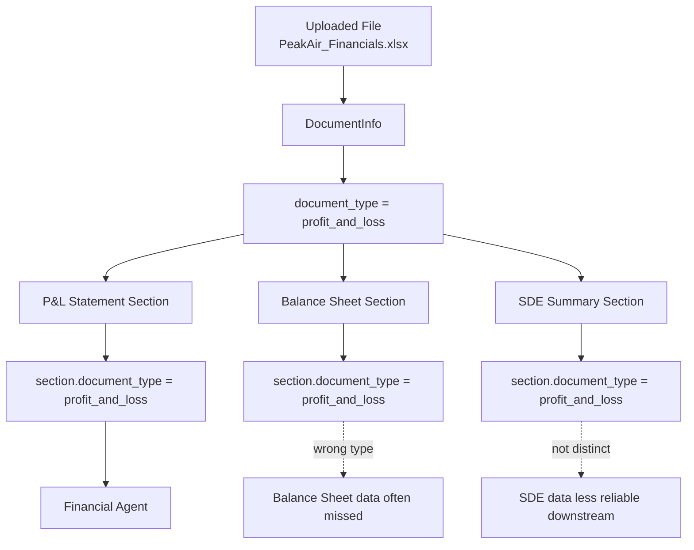
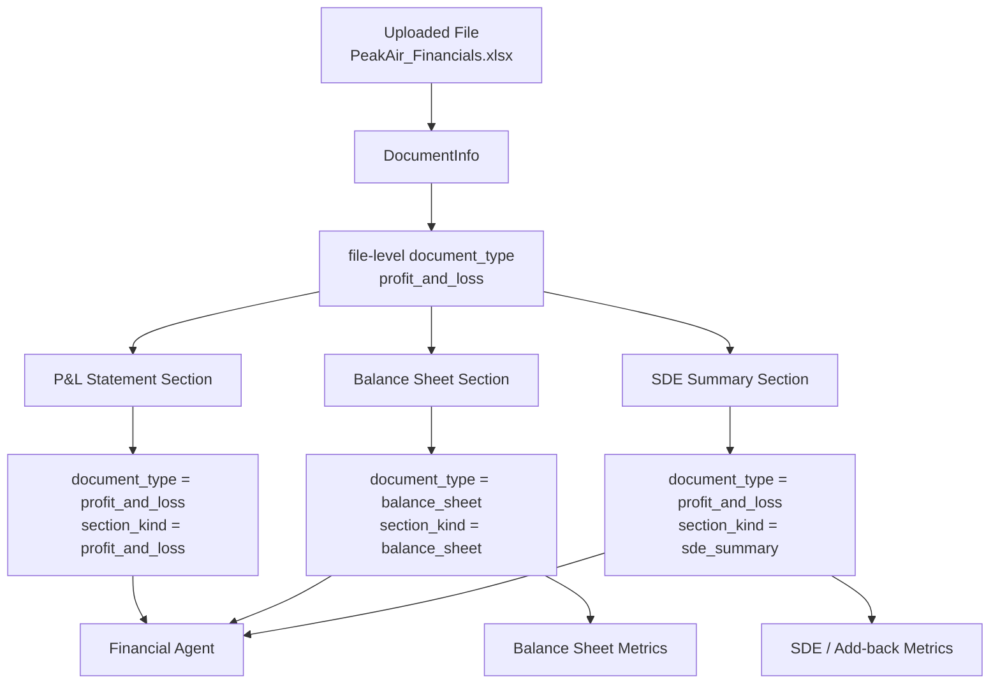
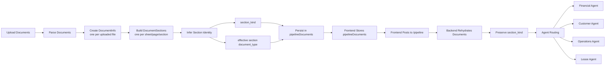

# Multi-Section Document Parser: Simple Visual Summary

This is the simplified version of what changed.

## The Problem Before

One uploaded workbook could contain multiple useful sheets, but the system treated every sheet as if it had the same type as the parent file.

Example:

```text
PeakAir_Financials.xlsx
  file type: profit_and_loss

  P&L Statement      -> treated as profit_and_loss
  Balance Sheet      -> treated as profit_and_loss
  SDE Summary        -> treated as profit_and_loss
```

That meant downstream agents could miss important sections.

For example, the balance sheet sheet existed, but because the parent file was classified as `profit_and_loss`, the balance sheet section could also look like `profit_and_loss` instead of `balance_sheet`.

## What Changed

The user still sees one uploaded file.

But internally, each meaningful section now gets its own durable identity.

```text
PeakAir_Financials.xlsx
  file type: profit_and_loss

  P&L Statement
    document_type: profit_and_loss
    section_kind: profit_and_loss

  Balance Sheet
    document_type: balance_sheet
    section_kind: balance_sheet

  SDE Summary
    document_type: profit_and_loss
    section_kind: sde_summary
```

The key idea:

```text
File type is the fallback.
Section type is what analysis should trust.
```

## Before



## After



## The New Pipeline



## Example: PeakAir Financials

```text
PeakAir_Financials.xlsx
  file type: profit_and_loss

  P&L Statement
    section_kind: profit_and_loss
    normalized fields:
      revenue
      cogs
      gross_profit
      net_income
      owner_salary

  Balance Sheet
    section_kind: balance_sheet
    normalized fields:
      current_assets
      total_assets
      total_liabilities
      equity

  SDE Summary
    section_kind: sde_summary
    normalized fields:
      sde
      interest_expense
      asking_price
      add_backs
```

The financial agent now receives all three relevant sections:

```text
P&L Statement
Balance Sheet
SDE Summary
```

## Example: Customer And Equipment Workbook

```text
PeakAir_CustomerList_PPE.xlsx
  file type: customer_list

  Customer List Sheet
    section_kind: customer_list
    used by: Customer Concentration Agent

  PP&E Schedule Sheet
    section_kind: equipment_list
    used by: Operations Agent
```

This lets one workbook feed multiple agents correctly.

## Plain-English Summary

The parser no longer treats a multi-sheet document like one blob.

The user still sees:

```text
PeakAir_Financials.xlsx
```

But the backend now sees:

```text
PeakAir_Financials.xlsx
  - P&L Statement      -> profit_and_loss
  - Balance Sheet      -> balance_sheet
  - SDE Summary        -> sde_summary
```

That identity survives the full trip:

```text
parse-documents
  -> frontend pipelineDocuments
  -> /pipeline
  -> agent analysis
```

So downstream agents now get the right sections instead of guessing from the parent file type.

